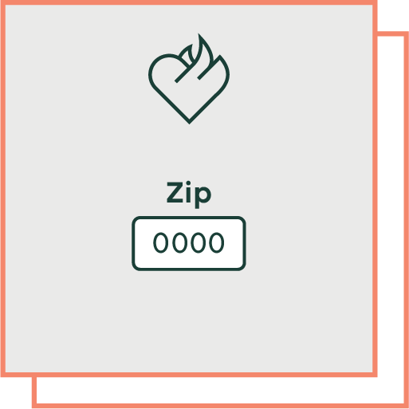
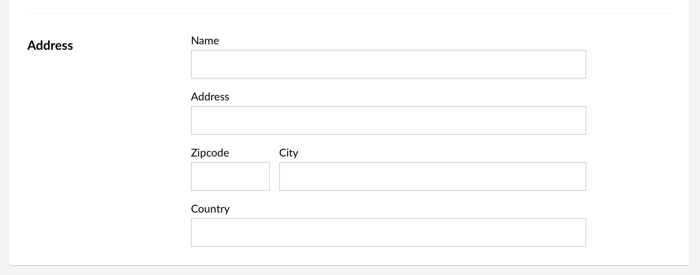
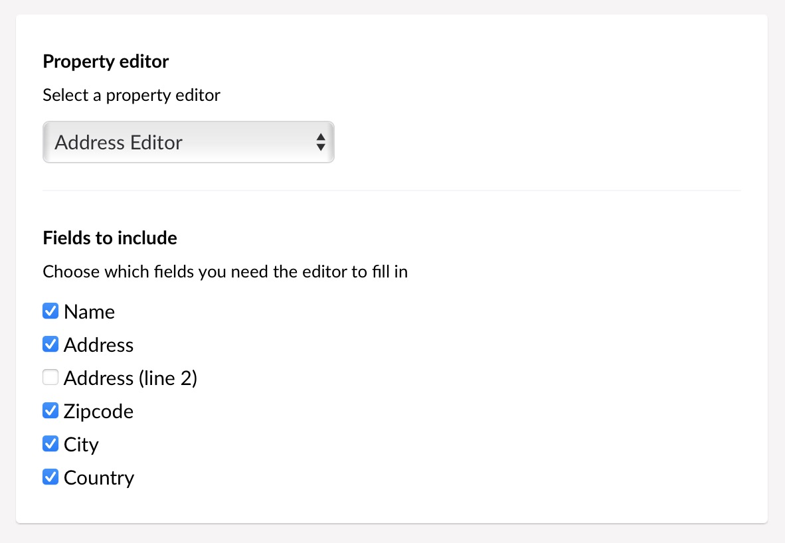

# Address Editor for Umbraco



This is a configurable address editor for Umbraco v7 & v8, that is
capable of putting the zip code and city name editors on the same row :)

It's a nice replacement for having 3, 4, 5 or more generic *Textstring* fields
on the doctype — a single property for the data instead of having to create a
convoluted *Nested Content/Archetype* setup for it.

The [releases page][RELS] has PropertyValueConverters for use in your projects.

[RELS]: https://github.com/vokseverk/Vokseverk.AddressEditor/releases

## Screenshots

### Editor



### Configuration



## Rendering

The raw value is a JSON object with the individual segments, e.g.:

```json
{
  "name": "Etch-A-Sketch",
  "address": "Streetname 55",
  "zipcode": "1234",
  "city": "East Drawing"
}
```

Using the PropertyValueConverter you can access them directly:

```razor
<div class="h-card">
	<div class="p-name">@(Model.Name)</div>
	<div class="h-adr">
		<div class="p-street-address">@(Model.Address)</div>
		<div>
			<span class="p-postal-code">@(Model.Zipcode)</span>
			<span class="p-locality">@(Model.City)</span>
		</div>
	</div>
</div>
```
